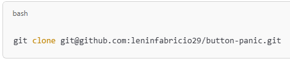
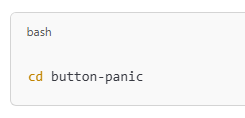
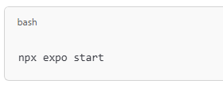
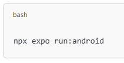

🚨 SafeGuard
SafeGuard es una aplicación móvil de botón de pánico desarrollada con React Native y Expo.
Permite emitir alertas de emergencia de manera rápida y confiable, interactuando con la API principal:

🌐 BaseURL: https://softkilla.es/api/

🛠 Tecnologías
⚛️ React Native (Expo SDK)

🟢 Node.js v20.9.0

☕ Java 17

🧭 Expo Router (navegación)

🤖 Android Capacities (paquete: com.leninyanangomez.buttonpanic)

⚙️ Requisitos
Node.js v20.9.0

Java 17

Expo CLI instalado globalmente:

📱 Dispositivo Android físico o emulador configurado.

🚀 Instalación
Clona el repositorio:

Accede al proyecto:

Instala las dependencias:

Inicia el servidor de desarrollo:

(Opcional) Ejecuta en un dispositivo Android:

🧩 Estructura del Proyecto
El proyecto está dividido en servicios que se encargan de consumir las distintas APIs.

Cada servicio maneja su propia comunicación y procesamiento de datos.

🔧 Configuración adicional

Configuración	Valor
Slug	button-panic
Versión	1.0.0
Paquete Android	com.leninyanangomez.buttonpanic
Iconos	Iconos adaptativos personalizados
📋 Notas importantes
Asegúrate de tener configurado el entorno de Android (Android Studio o dispositivo real).

La comunicación API es directa sobre protocolo HTTPS.

📄 Licencia
Este proyecto está licenciado bajo MIT License.